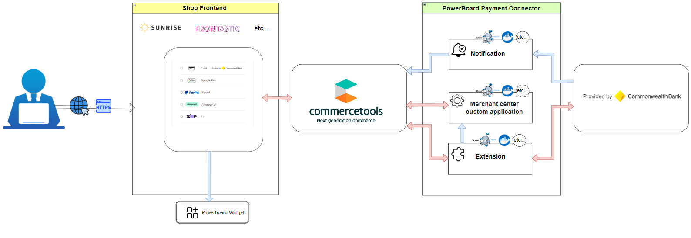

# Powerboard Payment Connector for commercetools

## Overview

The Powerboard Payment Connector allows seamless integration between your commercetools platform and Powerboard, enhancing your payment management processes.  This repository contains three primary modules:

### Extension Module
Acts as middleware to connect commercetools with Powerboard. It triggers on payment creation and updates within commercetools to ensure efficient event handling by Powerboard.
- [Integration Guide](extension/docs/IntegrationGuide.md): Detailed steps to integrate this module with commercetools.
- [How to Run](extension/docs/HowToRun.md): Instructions for deploying and running the extension module.

### Merchant center custom application
This application allows you to configure both live and sandbox connections to Powerboard. Additionally, you can view logs and orders processed through the Powerboard payment system.
- [Integration Guide](merchant-center-custom-application/docs/IntegrationGuide.md): Information on integrating this custom application with commercetools.
- [How to Run](merchant-center-custom-application/docs/HowToRun.md): Instructions for deploying and running the merchant center custom application.

### Notification Module
Manages asynchronous notifications from Powerboard about payment status changes (e.g., authorization, charge, refund). It updates the corresponding payment status in commercetools.
- [Integration Guide](notification/docs/IntegrationGuide.md): Information on integrating this module with commercetools.
- [How to Run](notification/docs/HowToRun.md): Instructions for deploying and running the notification module.

**Important**: Both modules are required to fully integrate your commercetools setup with Powerboard.

## Additional Resources
- [Powerboard Commercetools Widget](https://github.com/CommBank-PowerBoard/powerboard-e-commerce-commercetools-npm)
- [Official Powerboard Website](https://www.commbank.com.au/)

## License
This project is licensed under the [MIT License](LICENSE).