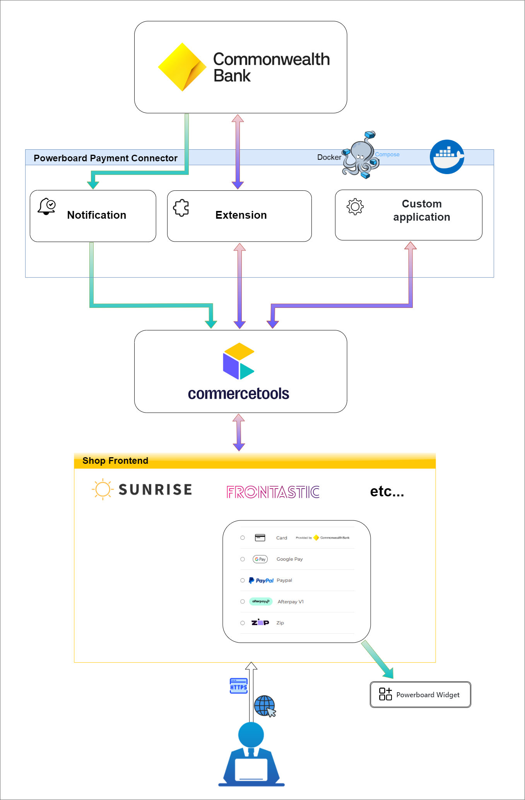

# Powerboard Payment Connector for commercetools

## Overview

The Powerboard Payment Connector allows seamless integration between your commercetools platform and Powerboard, enhancing your payment management processes.  This repository contains three primary modules:

### Extension Module
Acts as middleware to connect commercetools with Powerboard. It triggers on payment creation and updates within commercetools to ensure efficient event handling by Powerboard.
- [Integration Guide](extension/docs/IntegrationGuide.md): Detailed steps to integrate this module with commercetools.
- [How to Run](extension/docs/HowToRun.md): Instructions for deploying and running the extension module.

### Merchant center custom application
This application allows you to configure both live and sandbox connections to Powerboard. Additionally, you can view logs and orders processed through the Powerboard payment system.
- [Integration Guide](merchant-center-custom-application/docs/IntegrationGuide.md): Information on integrating this custom application with commercetools.
- [How to Run](merchant-center-custom-application/docs/HowToRun.md): Instructions for deploying and running the merchant center custom application.

### Notification Module
Manages asynchronous notifications from Powerboard about payment status changes (e.g., authorization, charge, refund). It updates the corresponding payment status in commercetools.
- [Integration Guide](notification/docs/IntegrationGuide.md): Information on integrating this module with commercetools.
- [How to Run](notification/docs/HowToRun.md): Instructions for deploying and running the notification module.

**Important**: Both modules are required to fully integrate your commercetools setup with Powerboard.

---

## Environment Variables

This connector consists of three main components, each with its own set of environment variables:

### Merchant Center Custom Application

#### Standard Configuration Variables

| Variable                | Description                          | Required | Default           | Example                              |
|-------------------------|--------------------------------------|----------|-------------------|--------------------------------------|
| `CUSTOM_APPLICATION_ID`  | The Custom Application ID            | Yes      | N/A               | `CUSTOM_APPLICATION_ID=my-app-id`   |
| `CLOUD_IDENTIFIER`       | The cloud identifier                 | No       | `gcp-eu`          | `CLOUD_IDENTIFIER=gcp-eu`            |
| `ENTRY_POINT_URI_PATH`   | The application entry point URI path | Yes      | N/A               | `ENTRY_POINT_URI_PATH=/my-app`       |
| `APP_REGION`             | The commercetools region             | Yes      | `europe-west1.gcp`| `APP_REGION=europe-west1.gcp`        |
| `APP_PROJECT_KEY`        | The commercetools project key        | Yes      | N/A               | `APP_PROJECT_KEY=my-project-key`     |

#### Secured Configuration Variables

| Variable              | Description                        | Required | Example                        |
|-----------------------|------------------------------------|----------|--------------------------------|
| `APP_CLIENT_ID`        | The commercetools client ID        | Yes      | `APP_CLIENT_ID=my-client-id`   |
| `APP_CLIENT_SECRET`    | The commercetools client secret    | Yes      | `APP_CLIENT_SECRET=my-secret`  |

---

### Extension Service

#### Standard Configuration Variables

| Variable                     | Description                   | Required | Default                                          | Example                                   |
|------------------------------|-------------------------------|----------|--------------------------------------------------|-------------------------------------------|
| `COMMERCETOOLS_PROJECT_KEY`  | The commercetools project key | Yes      | N/A                                              | `COMMERCETOOLS_PROJECT_KEY=my-project-key`|
| `COMMERCETOOLS_API_URL`      | The commercetools API URL     | Yes      | `https://api.europe-west1.gcp.commercetools.com` | `COMMERCETOOLS_API_URL=https://api.commercetools.com` |
| `COMMERCETOOLS_AUTH_URL`     | The commercetools Auth URL    | Yes      | `https://auth.europe-west1.gcp.commercetools.com` | `COMMERCETOOLS_AUTH_URL=https://auth.commercetools.com` |
| `POWERBOARD_API_LIVE_URL`    | Powerboard API live URL       | Yes      | N/A                                              | `POWERBOARD_API_LIVE_URL=https://api.powerboard.com` |
| `POWERBOARD_API_SANDBOX_URL` | Powerboard API sandbox URL    | Yes      | N/A                                              | `POWERBOARD_API_SANDBOX_URL=https://sandbox-api.powerboard.com` |
| `POWERBOARD_WIDGET_TYPE_SDK` | Widget type sdk               | Yes      | preproduction_cba                                                 | `POWERBOARD_API_SANDBOX_URL=https://sandbox-api.powerboard.com` |
| `POWERBOARD_WIDGET_URL`      | Powerboard widget url         | Yes      | N/A                                              | `POWERBOARD_API_LIVE_URL=https://api.powerboard.com` |
| `POWERBOARD_WIDGET_TEST_URL` | Powerboard widget test url    | Yes      | N/A                                              | `POWERBOARD_API_SANDBOX_URL=https://sandbox-api.powerboard.com` |

#### Secured Configuration Variables

| Variable                      | Description                        | Required | Example                               |
|-------------------------------|------------------------------------|----------|---------------------------------------|
| `COMMERCETOOLS_CLIENT_ID`     | The commercetools client Id        | Yes      | `COMMERCETOOLS_CLIENT_ID=my-client-id`|
| `COMMERCETOOLS_CLIENT_SECRET` | The commercetools client secret    | Yes      | `COMMERCETOOLS_CLIENT_SECRET=my-secret`|

---

### Notification Service

#### Standard Configuration Variables

| Variable                     | Description                    | Required | Default                                    | Example                                   |
|------------------------------|--------------------------------|----------|--------------------------------------------|-------------------------------------------|
| `COMMERCETOOLS_PROJECT_KEY`  | The commercetools project key  | Yes      | N/A                                        | `COMMERCETOOLS_PROJECT_KEY=my-project-key`|
| `COMMERCETOOLS_API_URL`      | The commercetools API URL      | Yes      | `https://api.europe-west1.gcp.commercetools.com` | `COMMERCETOOLS_API_URL=https://api.commercetools.com` |
| `COMMERCETOOLS_AUTH_URL`     | The commercetools Auth URL     | Yes      | `https://auth.europe-west1.gcp.commercetools.com` | `COMMERCETOOLS_AUTH_URL=https://auth.commercetools.com` |
| `POWERBOARD_API_LIVE_URL`    | Powerboard API live URL        | Yes      | N/A                                        | `POWERBOARD_API_LIVE_URL=https://api.powerboard.com` |
| `POWERBOARD_API_SANDBOX_URL` | Powerboard API sandbox URL     | Yes      | N/A                                        | `POWERBOARD_API_SANDBOX_URL=https://sandbox-api.powerboard.com` |

#### Secured Configuration Variables

| Variable                      | Description                        | Required | Example                               |
|-------------------------------|------------------------------------|----------|---------------------------------------|
| `COMMERCETOOLS_CLIENT_ID`     | The commercetools client ID        | Yes      | `COMMERCETOOLS_CLIENT_ID=my-client-id`|
| `COMMERCETOOLS_CLIENT_SECRET` | The commercetools client secret    | Yes      | `COMMERCETOOLS_CLIENT_SECRET=my-secret`|

## Commercetools customization

The default commercetools payment type does not include all the necessary fields required for full integration with Powerboard. Below is a table that outlines the required custom fields (which are automatically added after installing the connector) to the commercetools payment resource for proper handling of Powerboard-specific payment information:

| Field Name                     | Label                             | Type      | Input Hint    | Description                                                             |
|---------------------------------|-----------------------------------|-----------|---------------|-------------------------------------------------------------------------|
| `CommercetoolsProjectKey`       | Commercetools project key         | String    | SingleLine    | The commercetools project key                                           |
| `PowerboardPaymentStatus`       | Powerboard payment status         | Enum      | SingleLine    | The status of the payment in Powerboard (e.g., powerboard-pending, powerboard-paid, refunded, etc.) |
| `PowerboardTransactionId`       | Powerboard transaction ID         | String    | SingleLine    | Unique identifier of the transaction in Powerboard                         |
| `PowerboardPaymentType`         | Payment type                      | String    | SingleLine    | Type of payment processed via Powerboard(Card, PayPal and etc)             |
| `CommerceToolsUserId`           | Commerce tools user ID            | String    | SingleLine    | ID of the user in commercetools                                         |
| `SaveCard`                      | Save Card                         | Boolean   | SingleLine    | Indicates whether to save the card for future transactions              |
| `VaultToken`                    | Vault token                       | String    | SingleLine    | Vault payment token representing user’s payment information             |
| `AdditionalInformation`         | Additional information            | String    | MultiLine     | Any additional information relevant to the payment                      |
| `getVaultTokenRequest`          | Vault token request               | String    | MultiLine     | Request for generating a vault token                                    |
| `getStandalone3dsTokenRequest`  | Standalone 3DS token request      | String    | MultiLine     | Request for generating a 3DS token                                      |
| `getStandalone3dsTokenResponse` | Standalone 3DS Token Response     | String    | MultiLine     | Response from Powerboard after generating a 3DS token                      |
| `getVaultTokenResponse`         | Vault token response              | String    | MultiLine     | Response after generating a vault token                                 |
| `makePaymentRequest`            | Payment request                   | String    | MultiLine     | Data sent to Powerboard to make a payment                                  |
| `makePaymentResponse`           | Payment response                  | String    | MultiLine     | Response from Powerboard after attempting a payment                        |
| `RefundedAmount`                | Refunded amount                   | Number    | SingleLine    | The amount refunded via Powerboard                                         |
| `CapturedAmount`                | Captured amount                   | Number    | SingleLine    | The amount captured from the transaction                                |
| `PaymentExtensionRequest`       | Payment extension request         | String    | MultiLine     | Request for generating various operations associated with the payment, such as updating status, retrieving payment methods, and other actions. |
| `PaymentExtensionResponse`      | Payment extension response        | String    | MultiLine     | Response data related to payment extension requests       

### Enum Values for `PowerboardPaymentStatus`

The `PowerboardPaymentStatus` field is an enum with the following possible values:

| Key                     | Label                                |
|--------------------------|--------------------------------------|
| `powerboard-pending`        | Pending via Powerboard                  |
| `powerboard-paid`           | Paid via Powerboard                     |
| `powerboard-authorize`      | Authorized via Powerboard               |
| `powerboard-cancelled`      | Cancelled authorize via Powerboard      |
| `powerboard-refunded`       | Refunded via Powerboard                 |
| `powerboard-p-refund`       | Partial refunded via Powerboard         |
| `powerboard-requested`      | Requested via Powerboard                |
| `powerboard-failed`         | Failed via Powerboard                   |
| `powerboard-received`       | Received via Powerboard                 |
| `powerboard-p-paid`         | Partial paid via Powerboard             |

## Additional Resources
- [Powerboard Commercetools Widget](https://github.com/CommBank-PowerBoard/powerboard-e-commerce-commercetools-npm)
- [Official Powerboard Website](https://www.commbank.com.au/)

---

## Contribution

We encourage contributions! Please refer to the [Contribution Guide](docs/Contributing.md) for detailed information on how to contribute and run the modules locally.

---

## License
This project is licensed under the [MIT License](LICENSE).