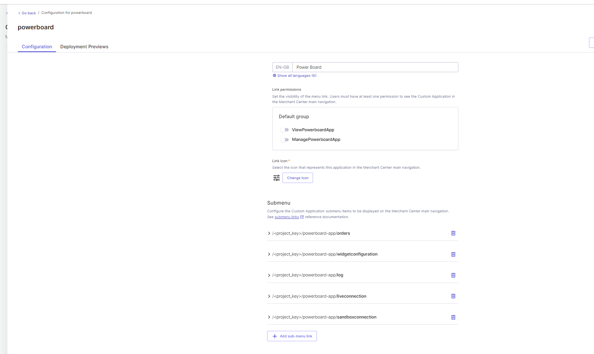
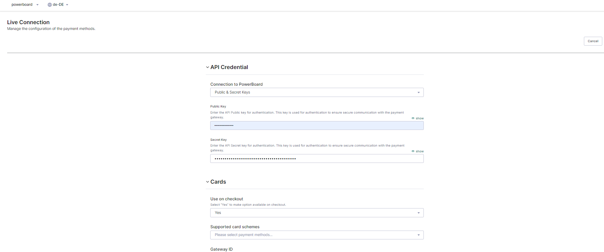
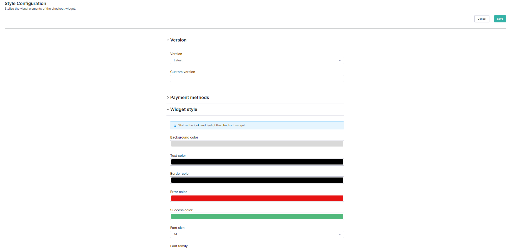
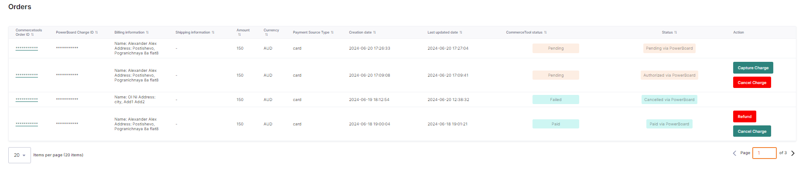
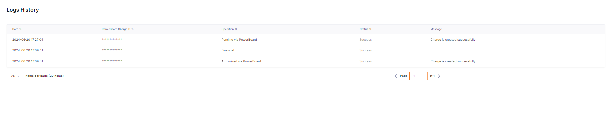

# Integration Guide

**Table of Contents**

- [Create Custom Application in Merchant Center](#create-custom-application-in-merchant-center)
- [Overview Pages](#overview-pages)
  - [Live Connection](#live-connection)
  - [Sandbox Connection](#sandbox-connection)
  - [Widget Configuration](#widget-configuration)
  - [Orders](#orders)
  - [Logs](#logs)
- [See Also](#see-also)
- [License](#license)

## Create Custom Application in Merchant Center

To create a Custom Application in the Merchant Center, follow these steps:

1. Navigate to the "Register a Custom Application" page.
2. Register a new application with the following values:
  - **Name:** For example, "Powerboard App".
  - **entryPointUriPath:** For example, "powerboard-app".
  - Additional fields as required.

Additionally, you will need to add the following pages:

- `/project_key/{entryPointUriPath}/liveconnection` - To set up a live connection (gateway, supported cards, fraud prevention, etc.) to the Powerboard system.
- `/project_key/{entryPointUriPath}/sandboxconnection` - To set up a sandbox connection (gateway, supported cards, fraud prevention, etc.) to the Powerboard system.
- `/project_key/{entryPointUriPath}/widgetconfiguration` - To customize the styles of the widget integrated into Sunrise and other frontend frameworks.
- `/project_key/{entryPointUriPath}/orders` - To manage orders processed through our payment system, such as changing order statuses.
- `/project_key/{entryPointUriPath}/logs` - To display and review logs for better transparency and troubleshooting.

## Overview Pages

### Live Connection

Set up a live connection (gateway, supported cards, fraud prevention, etc.) to the Powerboard system.

### Sandbox Connection

Set up a sandbox connection (gateway, supported cards, fraud prevention, etc.) to the Powerboard system.

### Widget Configuration

Customize the styles of the widget integrated into Sunrise and other frontend frameworks.

### Orders

Manage orders processed through our payment system, such as changing order statuses.

### Logs

Display and review logs for better transparency and troubleshooting.

## See Also

- [Powerboard Commercetools Widget](https://github.com/CommBank-PowerBoard/powerboard-e-commerce-commercetools-npm)
- [Powerboard Website](https://www.commbank.com.au/)

## License

This repository is available under the [MIT license](LICENSE).